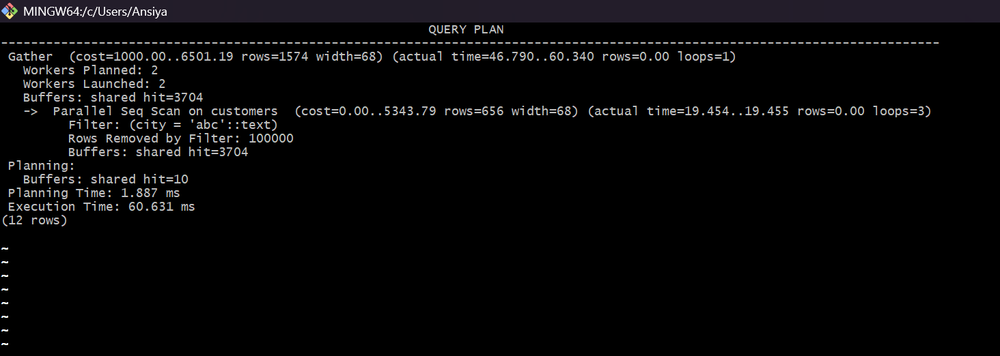
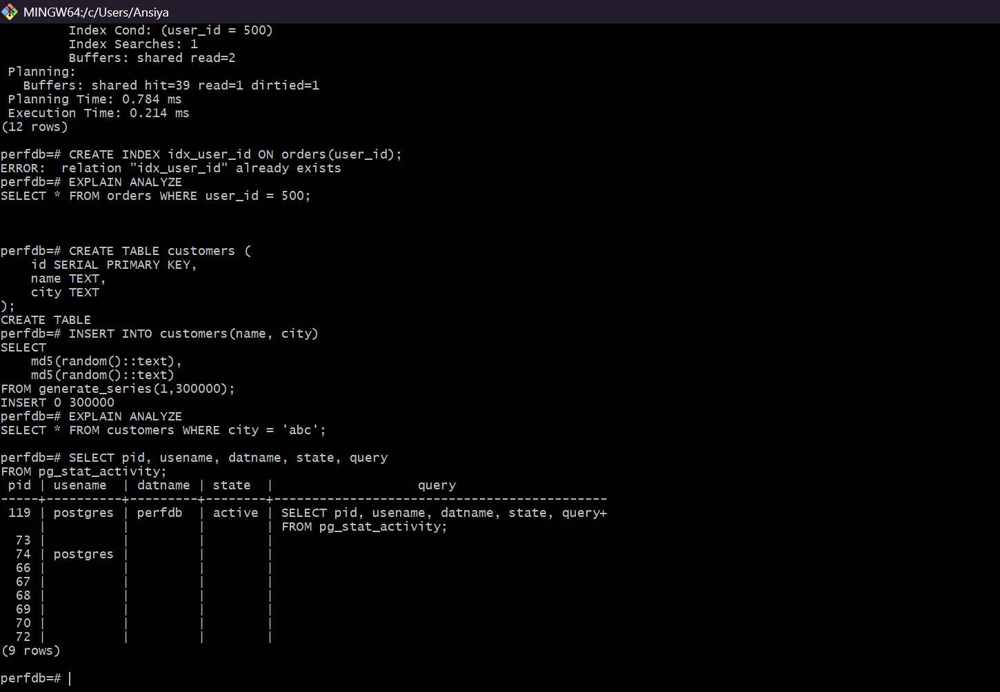
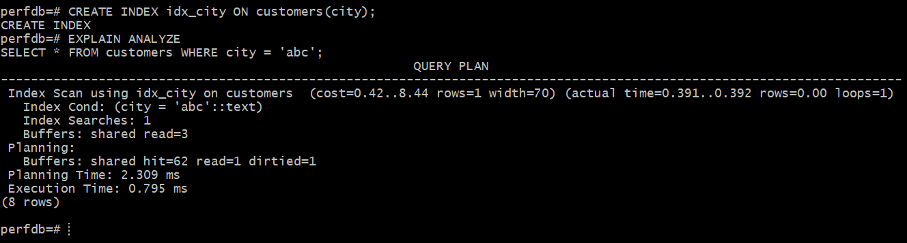

# PostgreSQL Database Troubleshooting

## Project Overview

This project demonstrates how to investigate and resolve database performance issues in PostgreSQL.

A slow query was analyzed and optimized using indexing.

---

## Problem

A query filtering by city was performing a sequential scan.

```sql
SELECT * FROM customers WHERE city = 'abc';
```

---

## Slow Query Execution



Execution Plan: Sequential Scan  
Execution Time: High due to full table scan.

---

## Investigating Database Activity

```sql
SELECT pid, usename, datname, state, query
FROM pg_stat_activity;
```



This helps identify running queries and active database sessions.

---

## Solution

Created an index on the `city` column.

```sql
CREATE INDEX idx_city ON customers(city);
```

---

## Optimized Query Execution



After indexing, PostgreSQL uses an **Index Scan**, significantly reducing execution time.

---

## Skills Demonstrated

- PostgreSQL troubleshooting
- Query performance investigation
- Database indexing
- Execution plan analysis
- CLI database debugging
